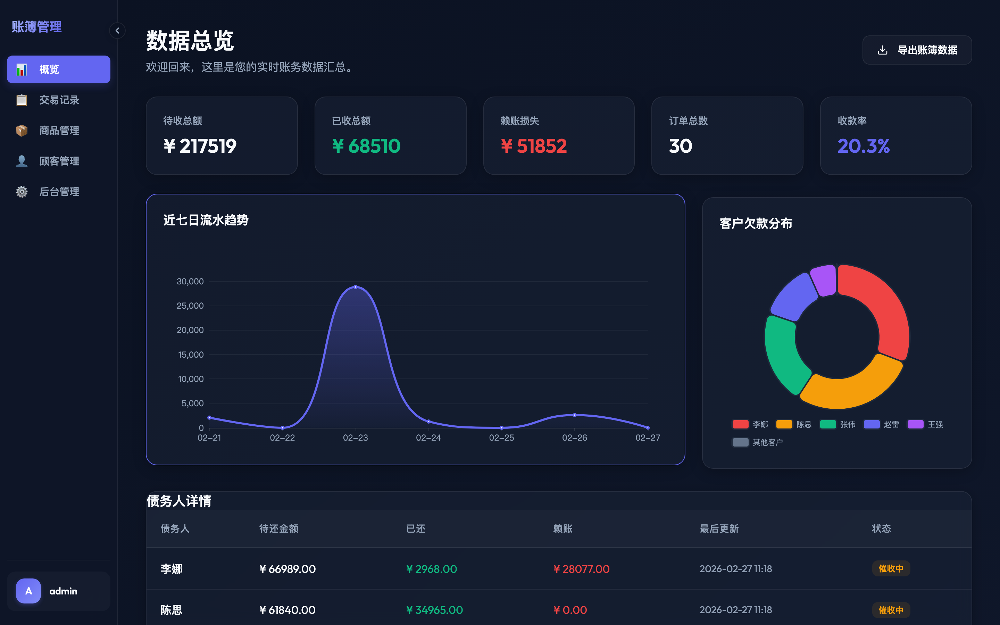
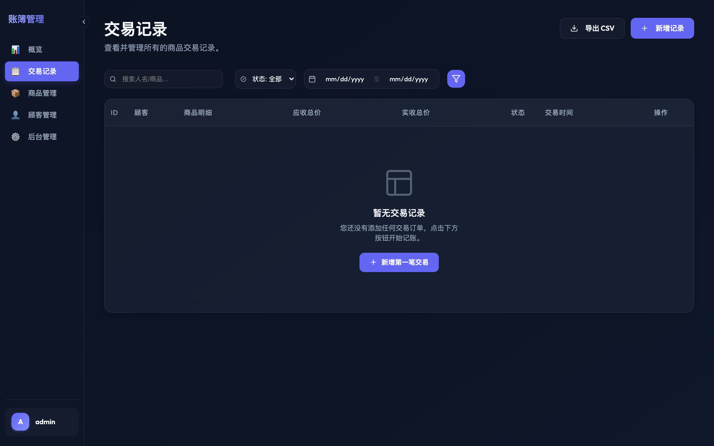
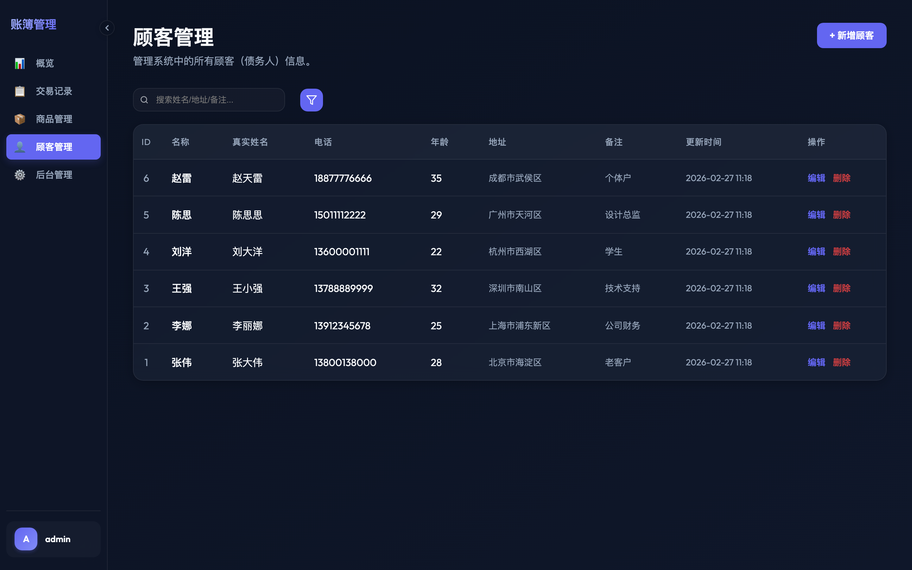

# AccountBooks 📒 账簿管理系统

<p align="center">
  
</p>

<p align="center">
  
  
  
  
  
  
</p>

> 一款面向小型团队与个人的**债务与账务管理系统**，界面现代、操作直观，帮助您清晰记录每一笔应收款项与回款情况。

---

## ✨ 核心特性

| 特性 | 说明 |
|------|------|
| 🎨 **多主题系统** | 内置 4 套精心设计主题（暗黑、浅色、极光、深紫），跨设备云同步偏好 |
| 📊 **实时 Dashboard** | ECharts 驱动的趋势图表，汇总待收、已收、赖账等核心指标 |
| 🧾 **订单行项管理** | 支持单订单多商品、各自独立设置数量，价格快照确保历史不变 |
| 💰 **财务级精度** | 全局使用 `DecimalField` 处理金额，防止浮点误差 |
| 🗑️ **逻辑删除** | 软删除机制，数据不丢失，支持业务审计 |
| 🔒 **生产就绪** | Gunicorn + Gthread 多线程，支持 Nginx 反代与 Docker 容器化部署 |
| 🚀 **现代包管理** | 使用 `uv` 极速安装依赖，告别 `pip` 慢与环境版本冲突 |

---

## 📸 界面预览

<table>
  <tr>
    <td></td>
    <td></td>
  </tr>
  <tr>
    <td align="center">📊 数据总览 Dashboard</td>
    <td align="center">🧾 交易订单列表</td>
  </tr>
  <tr>
    <td></td>
    <td></td>
  </tr>
  <tr>
    <td align="center">👤 客户账务总览</td>
    <td align="center">🎨 多主题切换器</td>
  </tr>
</table>

---

## 🚀 快速开始

### 方式一：一键初始化（推荐新手）

```bash
# 确保已安装 uv (https://docs.astral.sh/uv/getting-started/installation/)
curl -LsSf https://astral.sh/uv/install.sh | sh

# 克隆项目
git clone <your-repo-url>
cd AccountBooks

# 一键初始化：安装依赖 + 数据库迁移 + 创建管理员
./init_project.sh
```

脚本执行完成后，使用以下账号登录：

| 字段 | 值 |
|------|----|
| 用户名 | `admin` |
| 密码 | `admin123` |

```bash
# 启动开发服务器
uv run python manage.py runserver
```

访问：[http://127.0.0.1:8000](http://127.0.0.1:8000)

---

### 方式二：手动安装

```bash
# 1. 同步依赖并自动创建虚拟环境 .venv
uv sync

# 2. 数据库迁移
uv run python manage.py migrate

# 3. 创建超级管理员
uv run python manage.py createsuperuser

# 4. 启动开发服务器
uv run python manage.py runserver
```

---

### 生产环境部署

#### 直接部署（Gunicorn）

```bash
# 一键完成：迁移 + 收集静态文件 + 启动 Gunicorn
./start_prod.sh
```

> **配置说明**：默认使用 `1 Worker × 8 Threads` 模式，适合 50 人以下的内部使用场景。
> 建议配合 **Nginx** 处理静态文件与 SSL 证书。

#### Docker 容器化部署

```bash
# 构建镜像
docker build -f docker/Dockerfile -t accountbooks:latest .

# 运行容器
docker run -d \
  -p 8000:8000 \
  -v $(pwd)/db.sqlite3:/app/db.sqlite3 \
  -e USERNAME=admin \
  -e PASSWORD=yourpassword \
  --name accountbooks \
  accountbooks:latest
```

---

## 🛠️ 技术栈

| 层级 | 技术 |
|------|------|
| **Web 框架** | Django 5.x |
| **前端** | Vanilla HTML / CSS / JavaScript, ECharts |
| **数据库** | SQLite（开发/小型部署）|
| **WSGI 服务器** | Gunicorn + gthread Worker |
| **包管理** | uv |
| **容器化** | Docker |
| **后台管理** | Django Jazzmin |

---

## 📂 项目结构

```
AccountBooks/
├── accounts/              # 核心业务模块（模型、视图、路由）
│   ├── models.py          # 数据模型：AccountInfo、Order、GoodsInfo 等
│   ├── views.py           # 类视图（CBV）：列表、CRUD、Dashboard
│   └── urls.py            # 路由配置
├── templates/
│   └── base.html          # 基础模板（含多主题系统、侧边栏）
├── docker/
│   ├── Dockerfile         # 多阶段构建 Docker 镜像
│   └── docker-entrypoint.sh
├── scripts/
│   └── populate_data.py   # 示例数据生成脚本
├── start_prod.sh          # 生产环境一键启动
├── init_project.sh        # 项目一键初始化
└── pyproject.toml         # 项目配置与依赖
```

---

## 📝 开发规范

- 遵循 **Google Python Style Guide**
- **类视图（CBV）** 优先于函数视图（FBV）
- 业务逻辑下沉至 **Model 层**（如 `calc_total()`、`update_summary()`）
- 所有金额字段使用 `DecimalField` 保证精度
- 软删除代替物理删除，保留数据可追溯性

---

## 📄 License

本项目基于 [MIT License](LICENSE) 开源。

---

*由 Antigravity 协助构建与优化。*
